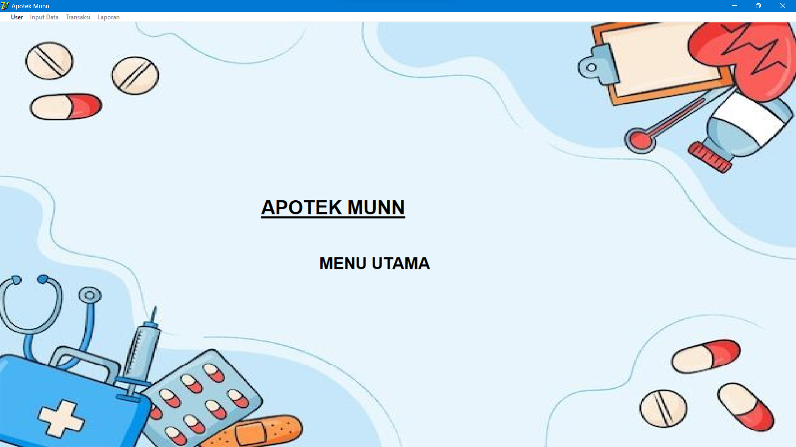
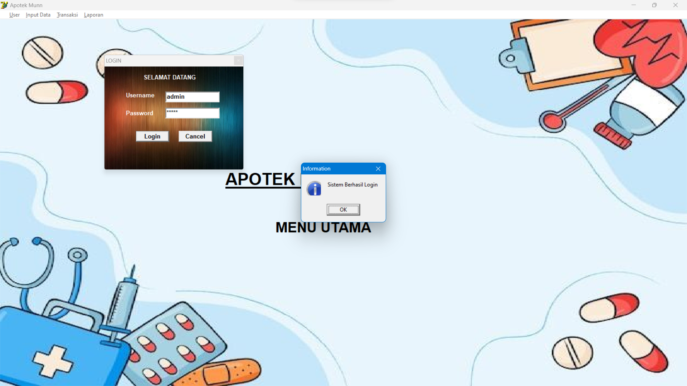
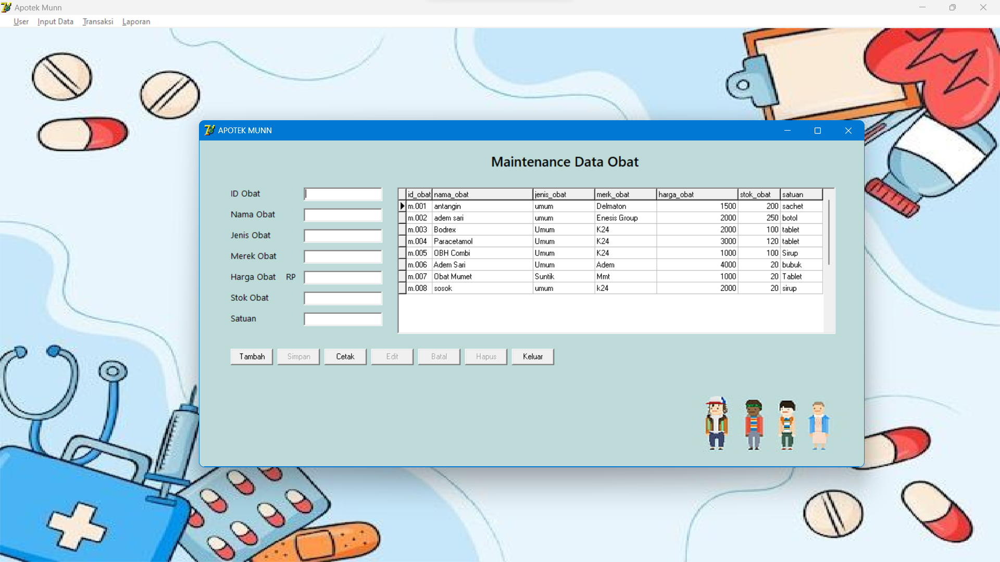
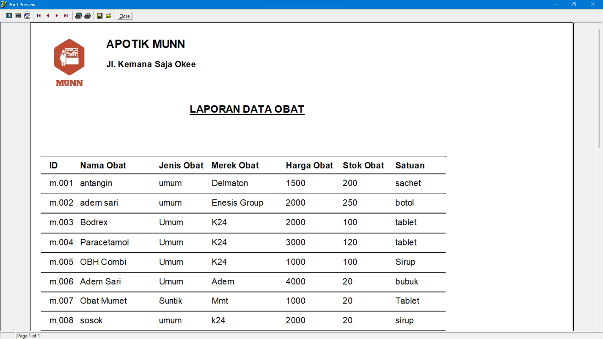

# Apotik

## Deskripsi:
Aplikasi Desktop berbasis Delphi 7 untuk mengelola data obat di Apotik

## Teknologi yang digunakan:
* Delphi 7
* Microsoft Access

## Fitur:
* Login
* Maintenance Data Obat
* Transaksi Penjualan
* Laporan Data Obat

## Tampilan:

### Menu Utama

 

### Login

### Maintenance Data Obat

### Laporan Data Obat

